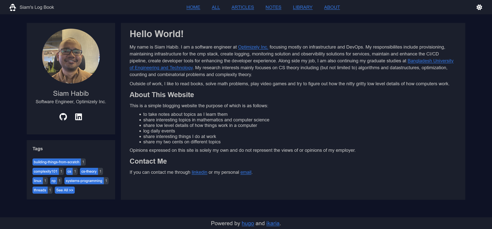

# Ikaria
A simple modern theme for generating responsive websites with [hugo](https://gohugo.io/).
ipads:
<p align="center">
  
  
</p>

phones:
<p align="center">
  
  
</p>

desktop:
<p align="center">
  
  
</p>

Ikaria was originally inspired from the hexo theme icarus. However, it is not an icarus clone. It neither tries to fully replicate icarus visually nor have full feature parity.

## Features
- Responsive Webpages, works on all form factors
- Has built in light and dark mode toggle.
- Has introduction card
- A versitile nav bar
- Allows organizing content with tags and categories
- Supports math using `KaTeX`
- Visually stunning code blocks with customizable themes for light and darkMode
- Allows for auto numbering of sections in content

## To Do
- [ ] Add table of content to pages
- [ ] Add hyperlink to headers
- [ ] Add shortcodes for definitions, theorems, remarks
- [ ] Add shortcodes for numbered equations
- [ ] Add support for bibliography
- [ ] Add RSS
- [ ] Add comments
- [ ] Add some sort of analytics

## Installation
You install hugo themes by cloning the repository inside `theme/` directory inside a hugo site and setting the theme attribute inside the hugo config file (`hugo.toml` or `hugo.yaml`).
```
# creating a new site
hugo new SITE

# clone the theme
cd SITE/theme
git clone git@github.com:hsiam261/ikaria.git
```

Then update the `hugo.toml` (or `hugo.yaml`) file by changing the value of theme to `ikaria`.
```
baseURL = 'https://example.org/'
languageCode = 'en-us'
title = 'My New Hugo Site'
theme = 'ikaria'
```

## Configuration
Your configuration file should look something as follows:
```
baseURL = "https://example.org/"
languageCode = "en-us"
title = "Hello World"
theme = "ikaria"

[markup]
  defaultMarkdownHandler = "goldmark"

  [markup.goldmark]
    [markup.goldmark.renderer]
      unsafe = true # enable unsafe rendering for raw html embedding

    # Required for enabling math
    [markup.goldmark.extensions.passthrough]
      enable = true
      [markup.goldmark.extensions.passthrough.delimiters]
        block = [['$$', '$$']]
        inline = [['$', '$']]

  # Required for syntax highlighting
  [markup.highlight]
    anchorLineNos = false
    codeFences = true
    guessSyntax = false
    lineNoStart = 1
    lineNos = true
    lineNumbersInTable = false
    noClasses = true
    noHl = false
    tabWidth = 4

[params]
  # set profile picture
  profilePicture = "/profile-pictures/profile.png"

  # enable math
  math = true

  # configure intro card in side panel
  cardHeading = "Name"
  cardSubheading = "Job Description"
  githubURL = "GIT PROFILE"
  linkedinURL = "LINKED IN PROFILE"

  # for setting themes for code block
  [params.codeBlock]
    [params.codeBlock.darkTheme]
      theme = "doom-one2"
    [params.codeBlock.lightTheme]
      theme = "emacs"

  # configuring nav bar
  [[params.menu]]
    name = "HOME"
    url = "/"
  [[params.menu]]
    name = "ALL"
    url = "/categories/all/"
  [[params.menu]]
    name = "ARTICLES"
    url = "/article/"
  [[params.menu]]
    name = "NOTES"
    url = "/note/"
  [[params.menu]]
    name = "LIBRARY"
    url = "/library/"
  [[params.menu]]
    name = "ABOUT"
    url = "/about"
```
